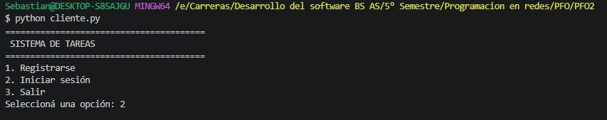
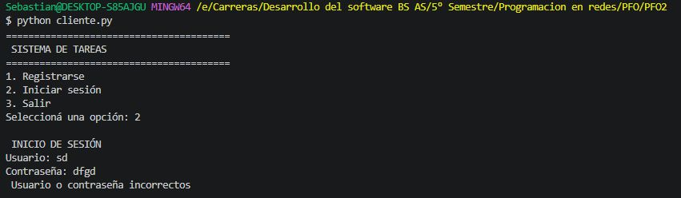
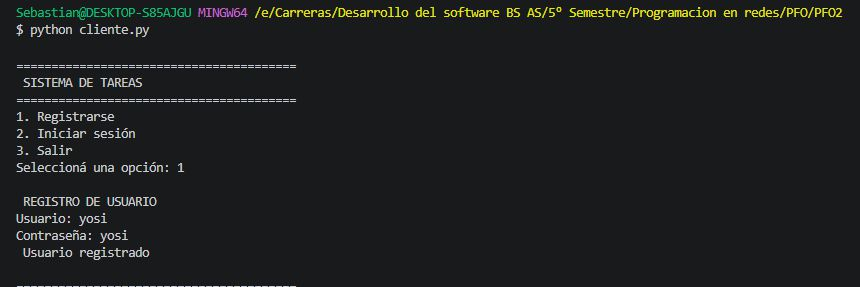
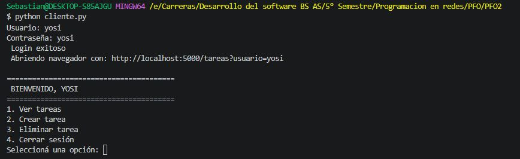
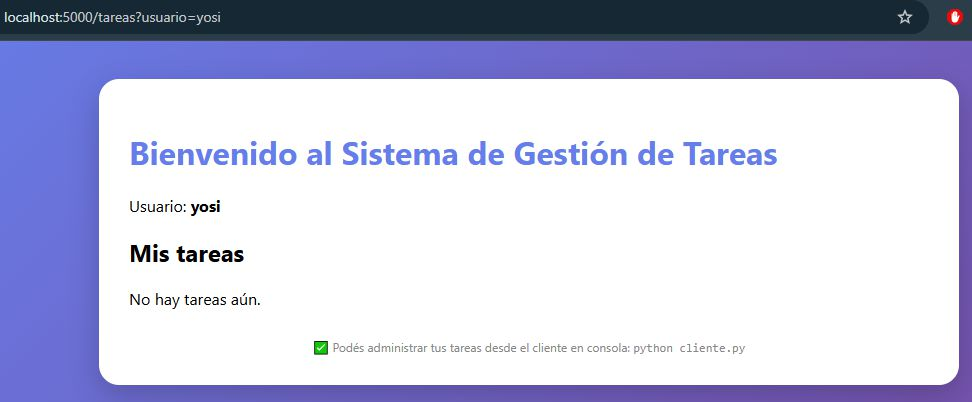
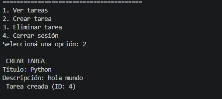
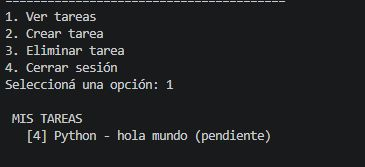
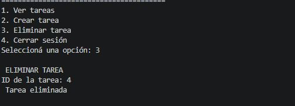

# PFO 2 GESTIÓN DE TAREAS

**Práctica Formativa Obligatoria N°2**  
Asignatura: Programación sobre Redes  
Tecnicatura Superior en Desarrollo de Software - IFTS N° 29

---

##  Alumno

**Gutiérrez, Sebastián**  
Comisión: 3°A  
Fecha: 5 Mayo 2026

---

##  Repositorio

[https://github.com/MSebastianGutierrez/pfo2-psr](https://github.com/MSebastianGutierrez/pfo2-psr)

---

##  Introducción

Este proyecto implementa una **API REST** con **Flask** para la gestión de tareas.  
Incluye:

- Registro de usuarios con contraseñas hasheadas (SHA-256)
- Inicio de sesión con devolución de token
- Almacenamiento persistente en **SQLite**
- **Cliente en consola** que permite:
  - Ver tareas
  - Crear tareas
  - Eliminar tareas
- **HTML de bienvenida** accesible desde el navegador en `GET /tareas?usuario=...`
- **Apertura automática del navegador** al iniciar sesión

---

##  Requisitos previos

- Python 3.8 o superior
- Instalar dependencias:

```bash
pip install Flask requests
```            
## Cómo probar el proyecto
Primero que nada, hay que tener Python instalado y descargar las librerías necesarias. 
Abrir una terminal en la carpeta del proyecto y escribimos:
```bash
pip install Flask Werkzeug requests
```

## Instrucciones de ejecución 
1. **Iniciar el servidor**
En una terminal, dentro de la carpeta del proyecto:
```bash
python servidor.py
```
El servidor se ejecutará en http://localhost:5000
La base de datos tareas.db se creará automáticamente.

2. **Ejecuta el cliente en consola**
Abri otra terminal y ejecutar el cliente para poder interactuar con la API de manera sencilla:
```bash
python cliente.py
```
3. Flujo de uso
Seleccionar "Registrarse" y crear un usuario
Seleccionar "Iniciar sesión" con el usuario creado
Se abrirá automáticamente el navegador con el HTML de bienvenida
Desde el menú del cliente podrás:
 Ver tareas
 Crear tareas
 Eliminar tareas
 Cerrar sesión

4. Ver el HTML de bienvenida manualmente
Si cerraste el navegador, podés volver a entrar en:

http://localhost:5000/tareas?usuario=TU_USUARIO
Ejemplo: http://localhost:5000/tareas?usuario=sebastian

## Capturas de pantalla

### Menú principal


### Login incorrecto


### Registro exitoso


### Login exitoso


### HTML de bienvenida


### Crear tarea


### Ver tareas


### Eliminar tarea


---

##  Endpoints de la API

| Método | Endpoint | Uso | Autenticación |
|--------|----------|-----|----------------|
| POST | `/registro` | Registrar usuario | ❌ |
| POST | `/login` | Iniciar sesión (devuelve token) | ❌ |
| GET | `/tareas?usuario=...` | HTML de bienvenida | ❌ (solo usuario) |
| GET | `/api/tareas?usuario=...` | Obtener tareas (JSON) | ❌ (solo usuario) |
| POST | `/api/tareas?usuario=...` | Crear tarea (JSON) | ❌ (solo usuario) |
| DELETE | `/api/tareas/{id}?usuario=...` | Eliminar tarea | ❌ (solo usuario) |
| POST | `/logout` | Cerrar sesión | ✅ (token) |

> **Nota:** El cliente en consola no usa token para simplificar la prueba del TP, pero el servidor está preparado para manejarlo.

## Respuestas Conceptuales

### ¿Por qué hashear contraseñas?
Hashear contraseñas es fundamental para la seguridad en caso de una filtración de datos. Si un atacante lograra vulnerar la base de datos, vería el hash (una cadena ilegible de caracteres) y no la contraseña en texto plano, lo que previene que las cuentas sean fácilmente robadas. 

### Ventajas de usar SQLite en este proyecto
1. **Simplicidad y cero configuración**: SQLite no requiere la instalación, configuración, ni administración de un motor de base de datos como MySQL o PostgreSQL. Funciona directamente sobre el almacenamiento local.
2. **Portabilidad**: Toda la base de datos y sus tablas residen en un solo archivo físico (`database.db`), lo que es excelente para prácticas como estas ya que el proyecto completo puede moverse de una computadora a otra sin problema.
3. **Librería estándar**: Python ya cuenta con el módulo `sqlite3` incluido de fábrica en su librería estandar evitando tener que descargar drivers externos adicionales para conectar la base de datos a la API en Flask.
